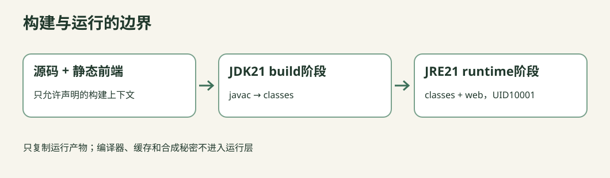

# C11-01 镜像不是虚拟机：把一笔订单的服务装进镜像

> 源码草稿：请先阅读共享项目的验证说明。Java、真实Docker/Redis和Academy原生Check尚未执行；preflight/up等词表示待集成的环境动作，不能当成已经可用的命令。HTTP示例要求你已启动对应的本机实验环境。



目标：你能亲手制作一个能接收HTTP、按TERM排空、非root运行且不包含编译工具的镜像。先不学Kubernetes。

## 开始前：只记住两个东西

“程序”是磁盘上的文件，“进程”是它正在运行的一次实例。镜像保存创建实例所需的文件和默认配置；容器启动后仍是一个受隔离和资源限制的进程。容器不需要“开机到桌面”。

先读共享项目 `materials/cloud-native/README.md` 的词典前九行。你要编辑本任务提供的Dockerfile；Java路由、网页、Redis协议均已提供。不要从零写前端，不要为本课创建独立版本台账。

## 检查点1：从调用结果倒着找程序

1. 从总课程根执行本课的 `preflight`。确认JDK21、Docker/Compose可用、HTTP端口18085空闲；发现占用时先辨认进程，不要擅自kill或自动换端口
2. 使用统一入口启动本课参考环境；入口只启动API与Redis
3. 打开 `http://127.0.0.1:18085/`，点击“进程存活”和“检查下游”
4. 用已提供调用方复现网页：

```sh
python materials/cloud-native/bin/call.py /live
python materials/cloud-native/bin/call.py /downstream-check
```

观察：第一条是HTTP200、UP；第二条是PONG。尚未seed时“业务就绪”可以503，这不是镜像构建失败。将观察按“命令→HTTP状态→JSON字段”记入 `observations.md`，不要只写“正常”。

自检：网页运行在浏览器，处理请求的Java进程运行在哪里？为什么网页不需要单独Nginx镜像？本项目由同一个HTTP进程提供静态HTML，因此减少一个与本课目标无关的工具。

## 检查点2：读一份能构建却不合格的starter

任务 `Dockerfile` 是单阶段starter。它用统一台账的构建镜像执行javac，再直接运行；它不是语法错误，而是交付内容过多。先预测下面三条，再运行可见验收：

- 最终镜像是否仍有javac/Maven和源文件？
- 进程默认用户是谁？
- 为什么“能返回200”不足以说明打包正确？

starter预期在“非root/无编译器”断言失败。不要删除断言，不要把失败解释成环境异常。只有Docker不可用或拉取失败等才归环境问题。

## 检查点3：画出构建边界

```
构建上下文（允许：src、web、必要container文件）
         |
         v
[build阶段：JDK21 / javac] -- 只复制classes --> [runtime阶段：JRE21]
      源码、编译工具留在此处                   classes + web
                                               |
                                         USER 10001:10001
                                               |
                                            Java进程
```

修改Dockerfile：

1. 全局声明 `ARG JAVA_BUILD_IMAGE` 和 `ARG JAVA_RUNTIME_IMAGE`，不提供latest默认值
2. 以构建镜像作为build阶段，固定工作目录，复制src并用`javac --release 21`编译到classes
3. 开始新的runtime阶段，使用JRE镜像；只复制class产物和web
4. 使用非root数值用户10001:10001。文件归属和读取权限要匹配；不能靠“给所有文件777”解决权限问题
5. 使用exec形式启动Java；声明容器监听8080。EXPOSE只是描述，不会自动把端口发布到宿主

先不要追求极限缩小镜像：这里的“最小运行层”表示不带本应用编译器/源码/构建缓存，不等于世界最小字节数，也不等于免漏洞。

## 检查点4：构建上下文也是安全边界

打开共享 `.dockerignore`。它首先排除全部，再只允许src/web及必要入口文件。解释为什么`.env`、answers、tests不会送入普通构建上下文。

错误思路：先`COPY . .`，下一层再删除`.env`。即使容器最终目录看不到文件，较早镜像层也可能保留。不要把真实凭证拿来测试；安全验收只用明确的合成标记。

你的验收至少要检查最终运行层没有 `/build`、`javac`、Maven和应用`.env`。静态扫描只是前置检查，真实镜像检查才是构建结果证据。

## 检查点5：停止时不能把顾客的请求扔掉

先执行一次 `/slow?millis=1500`。它模拟一个已接受、会在1.5秒完成的请求。真实容器验收器会等到 `slow_started` 日志才发送TERM，防止“请求尚未进入服务”造成假通过。

```
停止请求 -> Docker给容器主进程TERM
              -> JVM shutdown hook
              -> 标记draining（不再接新订单）
              -> HttpServer等已接请求，最多3秒
              -> 记录shutdown_completed
              -> 在容器总6秒预算内退出
```

通过的证据必须同时包含：已接请求收到完整200、出现shutdown_completed、总时长在预算内、不是OOM或137强制结束。只看容器“Stopped”是不够的。

错误入口放在共享 `wrong/entrypoint-swallow-term.sh`。它故意忽略TERM并把Java放后台。离线测试会用合成子进程证明该错误行为；真实Docker仍需单独检验PID1路径。不要把本机shell测试写成“Docker信号已通过”。

## 检查点6：解释两种正确答案

A. Dockerfile直接exec数组启动Java：没有额外shell，简单直观

B. Dockerfile exec启动一个小脚本，脚本最终`exec java ...`：可以先校验非秘密配置，但必须把shell替换掉。不能只把Java放后台然后wait

本批提供这两种JRE实现。Go静态二进制运行层仍是后续对照内容，尚未交付，不要把两种Java入口误叫Java/Go双实现。

## H1–H4 提示

- H1：先列出“运行时真正需要哪些文件”，再决定第二个FROM后有哪些COPY
- H2：`COPY --from=build /build/classes ...`比复制整个`/build`更准确
- H3：从进程树看谁接收到TERM，注意JSON形式与脚本最后的exec
- H4：参考 `materials/cloud-native/answers/Dockerfile.exec` 与 `Dockerfile.exec-script`，逐行解释后再移植，不改测试器

## 常见错误与纠正

| 症状 | 先看什么 | 不能直接做什么 |
|---|---|---|
| 拉取失败 | 真实镜像tag/digest、网络、daemon | 改latest碰运气 |
| class找不到 | COPY路径、classpath、编译输出 | 把整个工作区复制进去 |
| 非root读不到文件 | COPY归属、目录执行权限 | 全目录777 |
| 停止超时 | PID1、exec、shutdown日志 | 无限扩大停止预算 |
| /ready503 | 下游错误或未seed | 立即判镜像启动失败 |

## 面试与迁移

1. “多阶段主要为了减小镜像吗？”答题应包含构建/运行依赖边界、可复现与减少误带文件；不能宣称自动解决所有安全问题
2. “为什么容器停止时会丢请求？”先说明信号路径和请求排空预算，再结合网关摘流/连接关闭；本课只验证一个进程，不覆盖完整滚动发布
3. 将静态前端改一个可见文案，重建并核对响应。预测哪一层会失效，不必背Docker缓存规则

完成标准：Docker真实构建、HTTP与进程信号结果、镜像内容证据全部通过；若本机无Docker，保留NOT_RUN并提交已通过的离线证据，不可标完成。

## 官方参考核对

[Docker 多阶段构建](https://docs.docker.com/build/building/multi-stage/)。对照构建阶段和运行阶段的边界；本课的优雅停止合同仍以可见测试为准。

链接用于核对概念和 API；本文的固定依赖版本、公开测试及答案共同定义练习，不把官网最新示例自动升级为课程版本。
