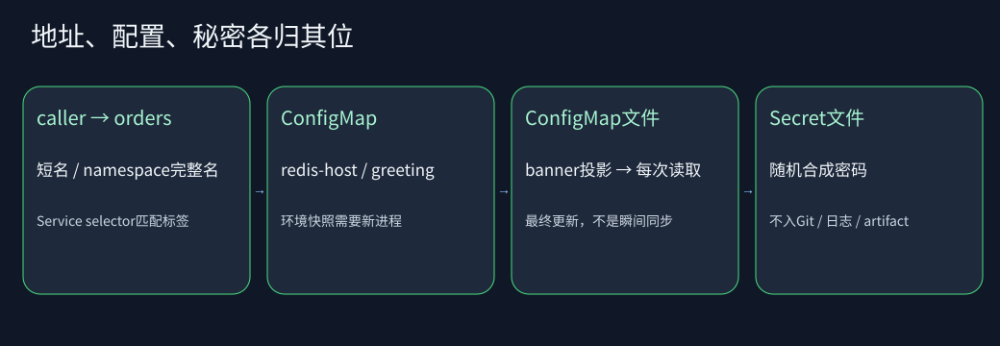

# C11-05 稳定地址、配置变化和秘密边界

预计90–120分钟。先完成C11-04。你将修复一条具体调用链，而不是部署另一个陌生系统。

## 1. 先用一句话区分三个概念

Service把变化的Pod藏在稳定名字后面；ConfigMap承载非秘密配置；Secret把秘密与普通配置分开管理，但它的base64表示不是加密，也不是天然只有管理员才能读取。



集群内caller访问orders:8080。Service选择app=orders的Ready Pod，targetPort=http映射到命名端口8080。API访问同namespace的redis:6379；不同Pod的localhost不是Redis。

## 2. 初始工程与调用入口

```text
01-dns-config-secrets/
  service.yaml        selector故意指错，修稳定入口
  config.yaml         redis-host故意为localhost，修依赖地址
  AppConfig.java      load()故意忽略REDIS_HOST，修配置读取
  rbac.yaml           已提供最小只读观察员，理解允许/拒绝边界
  test/               公开Check桥
  answers/            四份完整标准答案
```

Java AppConfig.load读取环境变量和Secret文件，构造不可变启动快照。KubernetesApp的/info每次调用banner()读取ConfigMap挂载文件，所以文件更新可被应用下一次读取看到；环境变量不会自己变成新值。/info明确不展示密码。

## 3. 动手顺序

1. service.yaml把selector改为app: orders，保留ClusterIP。外部访问只走localhost的临时转发，不改NodePort或LoadBalancer
2. config.yaml把redis-host改为redis。注意这个值是依赖Service名，不是API的orders
3. AppConfig.java让host读取REDIS_HOST，默认redis。保留非空、安全字符、非localhost校验和1..65535端口边界。不要把密码加入toString或异常
4. 阅读rbac.yaml：orders不需要调用Kubernetes API，所以不挂token；observer仅有同namespace的get/list观察权限，不含secrets和写权限

所有修改都在题目文件，driver复制后覆盖到临时完整工程。运行：

```sh
python "$PROJECT/tests/check_task.py" --task C11-05 --task-dir "$TASK_DIR"
python "$PROJECT/bin/verify_java.py" --task C11-05 --task-dir "$TASK_DIR"
python "$PROJECT/bin/lab.py" up --versions "$LEDGER" --task C11-05 --task-dir "$TASK_DIR"
python "$PROJECT/bin/lab.py" verify --scenario config
```

若上一课集群仍在，先down。默认不复用未知旧集群。

## 4. 真实实验观察什么

- caller用短名orders与完整名orders.<本次namespace>.svc.cluster.local都能得到/info 200
- selector临时写错后EndpointSlice没有可用后端，但API Pod仍Ready；恢复selector后原Pod重新可访问。这是选择器故障，不是应用死了
- 改ConfigMap公告后，逐个直连原有两个Pod，要求每个UID保持不变且/info.bannerFile最终变为banner-v2，greetingEnv仍是启动时hello-v1
- rollout restart重建API后，确认两个新UID都Ready，并逐个直连验证greetingEnv变成hello-v2、bannerFile为banner-v2
- `auth can-i`模拟observer：同namespace get pods=yes；create pods=no；get secrets=no；其他namespace get pods=no。既检查允许也检查拒绝
- 读取合成Secret只在测试内存中，与应用日志比对；测试输出只写是否泄漏，不写秘密、base64或可恢复形式

ConfigMap投影更新不是同步瞬间完成，公开测试给180秒观察窗口。若使用subPath挂载则不会获得同样的自动更新行为，本题刻意不使用subPath。生产是否重载应由应用语义定义，不能看到文件更新就假设连接池/缓存已刷新。

## 5. Secret究竟保护什么

本课每次新生成随机合成密码，经kubectl stdin创建Secret，不通过命令行参数传递，不落入Git或日志。API只挂载password；Redis从挂载的redis.conf读取密码，进程参数不含明文。密码更新本批没有自动协调轮换实现，不能把Secret对象更新当成客户端/服务端原子换密。

Secret仍可能被拥有读权限或创建可挂载该Secret工作负载权限的人获取。生产还需传输/静态加密、最小权限、审计与轮换；本地kind不是生产密钥托管系统。

## 6. 排错顺序

从调用方所在位置开始：同Pod localhost能通吗？Service是否有Ready EndpointSlice？selector能否匹配Pod标签？Service port→targetPort→containerPort是否一致？最后看DNS名是否在正确namespace。

不要用宿主机无法解析orders.svc.cluster.local来证明CoreDNS故障。这个域名是集群内服务发现；宿主浏览器用localhost转发。

配置错误在启动时应显式失败。日志只给startup_configuration_invalid，不打印完整配置对象。业务日志脱敏是风险降低手段，不能代替秘密访问权限。

## 7. 面试追问

1. ConfigMap改了为什么环境变量不变？已经运行的进程环境不是动态引用；需要新进程或应用自己的配置刷新机制
2. Secret为什么不能只是“base64密码”？base64可逆，保密靠访问控制、加密、传递与生命周期管理
3. 禁用token会不会使Service DNS失效？不会；访问业务Service不要求Pod带Kubernetes API token
4. RBAC没有写deny规则，为什么能拒绝？权限基于授予；未被任何适用授权允许的动作应拒绝，需注意多个RoleBinding叠加
5. 能创建Pod的人为何可能间接读Secret？他可能创建挂载Secret的工作负载；只限制直接get secrets并不足够
6. API变更为跨namespace调用该写什么？使用service.namespace或完整名，并分别考虑授权/网络策略；namespace本身不是完整网络隔离
7. 为什么没有给observer cluster-admin图省事？这样所有拒绝测试都会失去教学意义，也掩盖应用真正需要的权限

完成后写明你观察到的env/file更新时间差，不要只写“配置成功”。

## 官方参考核对

[Kubernetes ConfigMap](https://kubernetes.io/docs/concepts/configuration/configmap/)。对照环境变量和卷投影两种配置入口；Secret 与授权边界仍按本课单独检查。

链接用于核对概念和 API；本文的固定依赖版本、公开测试及答案共同定义练习，不把官网最新示例自动升级为课程版本。
