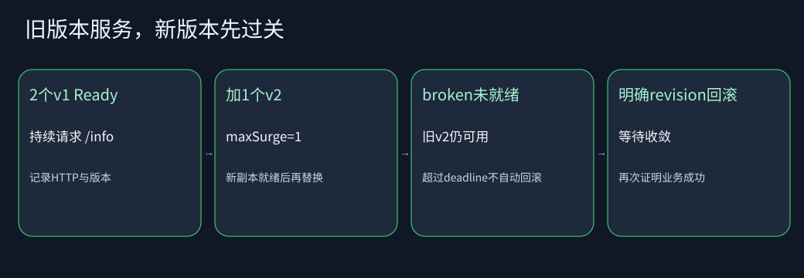

# C11-06 发布不是apply成功：预算、阻断、回滚

预计120–150分钟。先完成前两课。目标是发布v2、识别假成功、回到已知可用版本，并用证据区分应用未就绪与调度资源不足。

## 1. 先建立工程直觉



两份旧副本在服务，maxSurge=1允许额外创建一份新副本；新副本Ready并满足minReadySeconds后才可进一步替换旧副本。maxUnavailable=0表达更新时不主动减少可用副本的目标，但节点故障/业务错误仍可能造成中断，它不是全局SLA保证。

requests是调度时的资源需求，limits约束运行时资源。CPU limit通常表现为节流，内存超限可能被OOM终止；看见Pending不应该先调JVM堆，看见OOMKilled也不应只扩大readiness超时。

## 2. 初始项目与本课只需写什么

```text
01-rollout-and-resources/
  deployment.yaml   改策略、requests和保留历史
  test/             可见测试桥
  answers/          完整YAML标准答案
  observations.md   记录版本/修订/事件/恢复证据
```

Java项目已经能在/info返回镜像内的release，镜像构建阶段分别生成v1、v2和broken。三者共用相同Java基础镜像与大部分构建层，不再下载一组不同语言镜像。broken仍能/live=200，但/ready固定503，用它模拟“程序活着但业务不可接单”。

你的下一步：把maxUnavailable改为0、maxSurge改为1；replicas=2；requests CPU=100m/memory=128Mi；limits CPU=500m/memory=256Mi。保留revisionHistoryLimit=3、minReadySeconds=3和progressDeadlineSeconds=90。这些是本课程固定预算，生产值需测量，不能照抄为所有Java服务标准配置。

## 3. 先验静态合同，再运行发布

```sh
python "$PROJECT/tests/check_task.py" --task C11-06 --task-dir "$TASK_DIR"
python "$PROJECT/bin/lab.py" up --versions "$LEDGER" --task C11-06 --task-dir "$TASK_DIR"
python "$PROJECT/bin/lab.py" verify --scenario rollout
```

公开场景先用request_id验证订单幂等，再更新到v2。若上次验证已停留在v2，本次先明确恢复并验证v1基线，再执行真实v1→v2模板变化；不会把v2→v2空操作当作发布证据。幂等重放保留原订单响应中的库存值，测试另读当前库存验证重放和seed没有修改它，因此允许你在两次验证间提交其他合法订单。在更新期间重复由集群内caller请求/info，记录每次HTTP状态、release和Deployment availableReplicas。至少10个样本、全部200、观测可用副本不低于2，并最终全部新副本就绪，才继续下一步。

有限样本不能证明永不丢请求，更不能替代真实生产负载测试。本实验比只看apply退出码强，但仍是有边界的小规模验收。

## 4. 让坏版本暴露出来

脚本把image更新为broken。你应看到新Pod处于Running但不Ready；直接访问新Pod/live=200、/ready=503；旧v2仍通过Service处理请求。

Deployment最终Progressing=False、reason=ProgressDeadlineExceeded，说明发布超过观察期限。Kubernetes不会因此自动回滚。脚本保存已验证v2的revision，再明确rollout undo到那个revision，等待新修订收敛并验证/info重新返回v2。

如果你只记录“rollout status命令非0”，证据不足：断网、kubeconfig错误也能非0。要同时记录目标控制器状态、坏Pod探针响应与旧版本Service业务响应。

## 5. 资源故障与最小修复

```sh
python "$PROJECT/bin/lab.py" verify --scenario resources
```

脚本先确认单节点allocatable CPU低于故障请求，再让新副本请求1000 CPU，保证它无法调度，不实际消耗1000 CPU。旧副本继续服务。观察新Pod Pending、PodScheduled=False/Unschedulable，以及同UID的FailedScheduling事件含Insufficient cpu。恢复原资源请求，等待滚动完成，再验证HTTP业务。

这是调度资源不足实验，不是OOM或CPU节流实验。本批不运行metrics-server/HPA、不制造宿主内存耗尽，不把事件文字样例当实测。OOM、throttling的阅读与后续实验计划见[资源排障](../../../materials/kubernetes/docs/troubleshooting.md)。

## 6. 排障决策顺序

1. Pending：查看调度条件和events，核对requests、nodeSelector、污点与卷绑定；此时应用往往尚未启动
2. Running但not Ready：看startup/readiness、依赖地址/密码/seed和应用配置
3. restartCount增加：区分liveness杀死、OOMKilled、进程主动退出；抓上一个容器日志时不要输出Secret
4. Deployment旧副本仍在：检查新ReplicaSet是否就绪、可用数、progress deadline，不急着删除旧副本
5. 修复完成：重新请求业务接口，不以“Pod绿了”结束

## 7. 回滚的边界

Deployment回滚针对Pod模板历史，不会自动回滚数据库schema、外部消息、Secret内容、ConfigMap对象本身。本项目Redis状态单独存在于Redis Pod，本批无schema迁移。生产发布涉及迁移时必须设计前后兼容窗口和回退方案。

保留太少revision会丢失可选历史；保留过多也增加维护成本。rollback目标最好来自已验证的发布记录，而不是盲目回“上一次”，上一次可能也是坏版本。

## 8. 面试追问与取舍

- maxSurge=1与0的差异？峰值资源和替换速度；资源没有余量时新副本可能Pending
- maxUnavailable=0为什么也可能中断？策略只是控制器更新约束，不能消除底层故障或未正确探测的业务错误
- requests小、limits大能否提高稳定性？可能提高装箱率，但节点竞争时失去容量确定性；要以负载证据定预算
- Java -Xmx=128m、memory limit=256Mi为何不相等？线程栈、元空间、JIT、直接内存等也占容器内存
- CPU节流是否必须表现为重启？不一定，常先表现为延迟和超时
- deadline超时会自动回滚吗？不会，需人或发布系统明确策略
- rollback为什么不保证数据安全？进程模板与有状态数据迁移是不同生命周期

最后执行down。它只删除通过归属核验的本次独立kind集群，保留镜像缓存；不会执行全局prune。

## 官方参考核对

[Kubernetes Deployment](https://kubernetes.io/docs/concepts/workloads/controllers/deployment/)。对照滚动更新、可用副本及进度期限；资源预算依本课清单核对。

链接用于核对概念和 API；本文的固定依赖版本、公开测试及答案共同定义练习，不把官网最新示例自动升级为课程版本。
