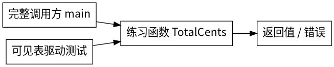

# C13-03 结构体方法与值指针

> 源码候选：Go/JUnit运行、主课程接入与原生IDE体验尚待验证；以下输出是练习合同的预期，不是已执行的结果。

## 本题可验收合同
Order零值和空Lines总额为0。每行UnitCents必须≥0，Quantity必须>0；按输入顺序验证并计算，首个失败立即返回(0,error)，绝不返回部分和。单价×数量及总和不能超int64上限。输入的切片及元素不得改变，同一订单可重复调用。价格以整数分计，不使用浮点数。错误优先级仅是本实验API约定，不是普遍企业标准。


## 你正在使用什么
这是主Java Academy课程里的可见Go源码练习，由公开JUnit桥调用真实go test；不是原生Go Academy课程。IDE的Go插件、Go断点与调试器尚未验证，不以“点了Check”推断所有测试执行。没有Docker，也不需要外部Go库。

- module（模块）：go.mod声明这一组代码的导入根和语言版本；类似Java项目坐标边界，但不是Maven的完整等价物
- package（包）：同目录Go文件的组织单位，本题根包叫lab；import引用其导入路径
- package main + func main：可执行程序入口，位于cmd子目录；main调用你补的函数
- *_test.go：测试源码，go test编译测试入口并运行Test开头的函数；go run不运行测试
- 零值：未赋值变量自带默认值；int为0、string为空串、error为nil。零值可用不代表符合业务合同

## 0. 先确认工具和目录
仓库不携带Go SDK。请按项目统一工具链要求准备官方Go 1.27.1；将GO_EXECUTABLE设为该编译器可执行文件的完整路径。下列是已设置该变量后的POSIX终端命令；不要把示例变量当安装脚本。

```sh
"$GO_EXECUTABLE" version
export GOTOOLCHAIN=local GOWORK=off GOENV=off GOFLAGS= GOPROXY=off GOSUMDB=off
```
预期第一行类似 go version go1.27.1 linux/amd64；系统平台可以不同，版本必须精确匹配。变量为空、路径不存在或版本不同是INVALID_ENV，不是题做错。Java桥也检查版本，且不会悄悄下载工具链。
在本题目录进入go子目录再运行下面命令；看到go.mod才说明目录正确。GO_EXECUTABLE与公共桥同名，Java入口不默认猜系统go路径。

## 1. 先读完整调用链，不要立即复制答案
```text
cmd/子命令/main.go -> lab.练习函数 -> 返回值/错误 -> 终端输出
                               ^
             contract_test.go逐项断言
Java Academy Check -> test/GoContractTest.java -> src/GoTestBridge.java
                                                -> go test -count=1 -v ./...
```
打开cmd里的main.go，找run如何调用练习函数；打开contract_test.go，读一组输入和期望。再看源码中“练习区”标记。只替换两条标记之间的代码，不改函数签名、import或测试。两种标准答案都能仅填进这一块，helper方案使用函数内小函数，不需要额外扩大编辑区。

## 2. 确认红灯是业务红灯
先构建所有包：
```sh
"$GO_EXECUTABLE" build -buildvcs=false ./...
```
预期无输出、退出0。-buildvcs=false只关闭可选Git版本水印，让从压缩包或受限工作区学习不依赖上层仓库状态；它不跳过编译或测试。go build只证明能编译；go run构建并执行main；go test还运行断言，不能互相替代。

```sh
"$GO_EXECUTABLE" test -run '^$' ./...
"$GO_EXECUTABLE" test -count=1 -v ./...
```
第一条只编译，starter应成功；它故意没有执行业务测试，绝不能据此算通过。第二条starter应以GREETING/QUANTITY/TOTAL业务消息失败，表明接线完整。如果是syntax error或undefined，先修编译；若显示[no test files]或SKIP，不算完成。超时属于检查失败，不是“测试已覆盖”。

## 3. 一次只补一个行为
先处理最简单成功输入，运行某个子例；再补空输入/边界；最后运行全部测试。命令中的TestContract是本题固定的表驱动测试名：
```sh
"$GO_EXECUTABLE" test -count=1 -v -run TestContract ./...
"$GO_EXECUTABLE" test -count=1 -v ./...
"$GO_EXECUTABLE" vet ./...
```
预期业务子例、调用方TestDemoOutput、输出失败TestOutputFailure、真实main进程TestMainProcess都PASS。vet无输出且退出0表示静态检查通过，不替代业务测试。race检测需平台支持的C工具链：如环境不支持，记录NOT_RUN及原因，不把它写成通过。

## 4. 运行调用方并做迁移
```sh
"$GO_EXECUTABLE" run ./cmd/order
```
正确实现预期：
```text
订单总额=548分
原数量=2
```
逐行把输出对应到main.go里的输入。若输出不一致，先直接对比函数返回值，再看调用方格式化。错误不一定是panic：有些错误通过第二返回值传给调用方处理。
修复后保留starter红灯记录与自己的绿灯记录，回答本文末尾的追问。观察题：画出参数、局部变量、返回值。Go断点操作要等IDE插件单独验收；本候选不能宣称已验证调试器，可用测试和打印先跟踪这三个值。此观察不伪装成自动评分通过。

## 5. 常见排错
- 找不到go.mod：在本题go目录运行，不能在课程根盲跑
- import未使用：不要删固定import；exercise.go中保留编译锚点让两种练习区实现共享import集合，生产代码通常只导入真正需要的包
- 刚改代码却读到旧绿灯：加-count=1；公共桥禁用Gradle缓存并核对具体子例名
- 测试文件改绿：不属于完成；测试与调用方是合同，修练习区
- 中文标点不同：字符串比较逐字节比较，中文逗号和英文逗号不相同
- 不知道如何恢复：完整答案在answers/*.go.txt；把练习区代码替换回task-info.yaml的placeholder_text，勿覆盖其他文件

## 分步练习与迁移观察：结构体与钱
1. `Line{UnitCents:199, Quantity:2}`类似给Java对象两个字段赋值。`Order{Lines: []Line{...}}`包含一组明细。读取cmd/order/main.go，先手算199×2+50×3=548分；写下为什么不能是5.48的float结果。
2. `func (o Order) TotalCents()`里括号中的o叫接收者，类似Java实例方法中的this，但它是显式声明的值副本。`var total int64`的零值是0。`for _, line := range o.Lines`用下划线忽略索引，line是当前元素的副本。不要通过索引写回输入。
3. 先判非法单价/数量，再证明乘法安全：`UnitCents <= MaxInt64 / Quantity`。只有Quantity已大于0才能这样除。然后证明加法安全：`total <= MaxInt64 - subtotal`。失败立即返回0和对应错误，成功累计后返回total,nil。跑一行、多行、精确大整数，再跑两个溢出子例。最后混合两种错误：第一行已经溢出时，不能因后面有非法字段而把错误改成ErrInvalidLine；反过来第一行非法也不能被后行溢出覆盖。合同是逐行首错，不是先全量校验一类错误。这仅是本实验API约定，不是通用企业标准。
4. 用纸画`o -> Lines描述符 -> 数组`；结构体值复制只复制描述符，仍可能指向同一数组。运行输入不改写与共享切片子例，再读wrong-solutions/mutate-shared.go.txt：为什么值接收者仍会污染另一个订单？下一课C13-04专门解决快照隔离。

## 本题逐步实现
值接收者复制Order这个小结构体，但Lines切片仍指向同一数组，因此“值接收者”不自动等于深拷贝。range读出line副本，只读取它就不会改写订单。先排除Quantity≤0，再做除法上界检查，防止除零或负数扰乱边界；乘法、加法前各检查一次。

## Java对照
Java对象变量通常保存对象引用；Go struct赋值复制字段。Go的指针*Order可以引用原结构体；但struct里包含slice时，复制的slice描述符仍共享底层数组，这正是下一课快照所有权的先修。func (o Order) TotalCents 是值接收者方法，&o是取地址；读取计算用值接收者即可。

## 提示H1–H4
- H1：先把合同中的正常输入手算一遍，再读TestContract同名子例
- H2：值接收者复制Order这个小结构体，但Lines切片仍指向同一数组，因此“值接收者”不自动等于深拷贝
- H3：阅读answers中第一种完整答案，标出每一个提前return对应的合同
- H4：逐行替换练习区，再对照第二种实现；不用修改import和测试也应全部通过

## 标准答案与解释

### explicit
仅填入练习区：
```go
	var total int64
	for _,line := range o.Lines {
		if line.UnitCents < 0 || line.Quantity <= 0 { return 0, ErrInvalidLine }
		if line.UnitCents > math.MaxInt64/line.Quantity { return 0, ErrTotalOverflow }
		subtotal := line.UnitCents * line.Quantity
		if total > math.MaxInt64-subtotal { return 0, ErrTotalOverflow }
		total += subtotal
	}
	return total, nil
```
完整可比较源码见go/answers/explicit.go.txt。

### checked
仅填入练习区：
```go
	checkedLine := func(line Line) (int64,error) {
		if line.UnitCents < 0 || line.Quantity <= 0 { return 0, ErrInvalidLine }
		if line.UnitCents != 0 && line.Quantity > math.MaxInt64/line.UnitCents { return 0, ErrTotalOverflow }
		return line.UnitCents*line.Quantity, nil
	}
	checkedAdd := func(a,b int64) (int64,error) {
		if b > math.MaxInt64-a { return 0, ErrTotalOverflow }
		return a+b,nil
	}
	var total int64
	for _,line := range o.Lines {
		n,err := checkedLine(line); if err!=nil { return 0,err }
		total,err = checkedAdd(total,n); if err!=nil { return 0,err }
	}
	return total,nil
```
完整可比较源码见go/answers/checked.go.txt。

两种实现遵守同一合同，而不是两个不同预期。值接收者复制Order这个小结构体，但Lines切片仍指向同一数组，因此“值接收者”不自动等于深拷贝。range读出line副本，只读取它就不会改写订单。先排除Quantity≤0，再做除法上界检查，防止除零或负数扰乱边界；乘法、加法前各检查一次。

## 面试递进与迁移
1. 为什么不能先乘再判断结果是否大于MaxInt64？溢出已发生，结果可能绕回负数。
2. 为什么金额不用float64？2^53以上不是每个整数都能精确表示，分也会丢失。
3. 值接收者是否保证绝不改原对象？不保证，切片/map/指针字段指向的数据仍可能共享。
4. range里改line.Quantity会修改订单吗？line是元素副本；o.Lines[i].Quantity才改底层元素，本题两者都不需要。
5. 迁移：加入折扣应如何定义舍入、负金额和错误优先级？先写合同，再做整数运算；不要直接用浮点折扣因子。

## 图示


## 验收边界
原矩阵用例数量是设计估算，不当已通过数。本候选每题一个Academy task，教学阶段不冒充三个已交互验收task。原生IDE导入、Check及Go调试仍NOT_RUN；Go/Java命令执行结果需要单独记录。

## 官方参考核对

[Go 规范：方法声明](https://go.dev/ref/spec#Method_declarations)。对照方法与接收者，再解释本课的值、指针和整数金额选择。

链接用于核对概念和 API；本文的固定依赖版本、公开测试及答案共同定义练习，不把官网最新示例自动升级为课程版本。
