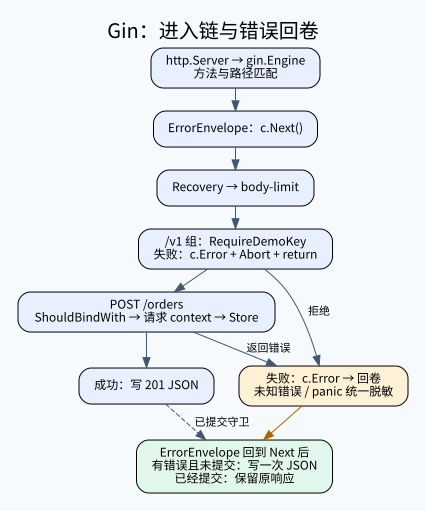

# C13-06 Gin 路由、中间件和统一错误

目标：在上一题完全相同的订单业务上，亲手装配 Gin 路由组、演示门禁和统一错误处理中间件。不要只会写一个 router.POST；必须能解释每个处理器为什么会继续、停止或回到上一层。

前置：先完成 [net/http 练习](../request-lifecycle/task.md)。固定版本、离线缓存和服务启动见 [学习路线](../../../materials/go-http/学习路线与边界.md)。本题 Go 1.27.1 + Gin v1.12.0，所有命令保持 -tags=nomsgpack。



## 1. 框架增加了什么

Gin Engine 仍然实现 net/http.Handler，Server 依旧负责监听与连接；Gin 负责匹配方法/路径、组合 handlers 链并提供绑定/渲染等便利函数。Gin 不自动提供数据库事务、幂等性或生产身份认证。

NewHandler 使用 gin.New()，显式注册 ErrorEnvelope → Recovery → body-limit；再注册公开 /healthz 和 /v1/orders。它没有 gin.Default() 自带的 Logger/Recovery。本题的 Recovery 只把未提交的 panic 归一为短错误，不将 panic 细节或请求头打印到客户端。

完整调用链：cmd/server/main.go → http.Server → gin.Engine.ServeHTTP → 全局中间件 → /v1 组门禁 → POST /orders → StrictJSON → Store → 状态/JSON → 中间件回卷。

## 2. 输入、输出与编辑范围

POST /v1/orders 要求 X-Lab-Key: training-key；这个公开字符串只演示拒绝流程，不能用于生产认证。GET /healthz 保持公开。其他 body、校验、context 和业务响应合同与上一题一致：先判 Content-Type，失败415；有界流式解码出现较早的语法、未知字段或额外值错误则400，不排空请求来强求413；只有解码实际返回 MaxBytesError 才413。超长且非法的输入可返回400，均不得调用 Store。256字节是可接受 body 上限，溢出探测可读取第257字节，不能当成慢体超时；Gin 还统一 404 route_not_found、405 method_not_allowed。此课关闭自动尾斜杠跳转，避免客户端将路由错误误看成成功重定向。

你只补 exercise.go 的三个区域：RequireDemoKey、ErrorEnvelope、RegisterOrders。不要改变测试、Store、StrictJSON 或固定 API。

- model.go：与上一题相同的业务类型、Store 接口、错误分类
- binding.go：实现 Binding 接口的局部严格 JSON 绑定器
- router.go：明确的全局顺序、恢复与不存在路由处理
- contract_test.go：28组输入（包括混合错误优先级）、context、真实 TCP/取消、内存存储并发
- middleware_test.go：具名验证停止链、回卷顺序、错误脱敏、响应已提交和 panic
- cmd/server：可以独立运行的完整调用方，不依赖隐藏服务

## 3. 实作一：路由与门禁

首先让 RegisterOrders 建立 /v1 路由组，组上使用 RequireDemoKey，再注册 POST /orders。group.POST 中路径只写 /orders，最终才是 /v1/orders；不要误写成 /v1/v1/orders。

RequireDemoKey 拒绝时记录一个带状态与公开消息的 Problem，然后 c.Abort() 并 return。三者作用不同：c.Error 记录错误，不写响应、不终止链；Abort 令后续 handler 不再执行；return 停止当前 Go 函数剩余语句。

仅 return 不足以阻止后面的 handler：Gin 外层链循环仍可能继续。仅 Abort 也不会自动跳出你当前函数。允许通过时调用 c.Next()，这样其后可以放明确的“下游完成后”逻辑。

```sh
"$GO_EXECUTABLE" test -buildvcs=false -mod=readonly -tags=nomsgpack -p=1 -count=1 -v -run 'TestGinPipeline/(unauthorized_stops_chain|health_is_public|next_unwinds)' .
```

先跟踪 unauthenticated 请求：错误在哪记录？谁负责把它写成 JSON？Store 调用数为什么必须是0？再用 valid 请求确认不是“全部拒绝”碰巧通过。

## 4. 实作二：错误回卷与单次响应

ErrorEnvelope 必须先 c.Next()，待下游完成后才检查 c.Errors。若没有错误或 c.Writer.Written() 为真，直接 return。否则用 classify 得到稳定 status/code/message，只写一个错误对象。

已提交响应不能补救成另一个 status；如果某处理器先写202，又 c.Error，ErrorEnvelope 不能追加一个500 JSON。生产通常需要可关联日志/指标记录这类异常；本题只实现“不覆盖、不泄密”的公开响应规则，不宣称已经有生产日志系统。

```sh
"$GO_EXECUTABLE" test -buildvcs=false -mod=readonly -tags=nomsgpack -p=1 -count=1 -v -run TestGinPipeline .
```

unknown_error_redacted 必须看不到 secret；committed_response_not_overwritten 必须仍然是唯一202对象；panic_sanitized 必须是500且不含私有 panic 文本。中间件顺序不能随便交换：ErrorEnvelope 在外，Recovery 在内，panic 先被内层转为 c.Error，外层才能在回卷时渲染它。

## 5. 实作三：绑定、context 和业务调用

路由里用 c.ShouldBindWith(&input, StrictJSON{})。失败时 c.Error(err)、Abort、return，让统一中间件决定格式。成功时 context.WithTimeout(c.Request.Context(), budget)，defer cancel，再调用 Store。注意这里传入下游的是标准 context.Context，不是长期保存或跨 goroutine 使用 *gin.Context。

为什么没有直接用 ShouldBindJSON？本课要求拒绝未知字段和第二个 JSON 值；默认 JSON 绑定流程不是这个完整合同。我们用局部自定义 binder 显式完成 DisallowUnknownFields、第二次 Decode 得 EOF、TrimSpace，再执行 Gin 的 binding.Validator.ValidateStruct。这样不用修改全局 EnableDecoderDisallowUnknownFields，不会让别的测试/路由被进程级开关污染。

为什么不用 BindJSON？MustBind 类便利方法在错误时会提前写400并终止，使你的统一错误格式/422策略更难掌控。ShouldBind 系列返回错误，由你决定如何响应；它并不意味着“失败时框架替你处理了”。

binding 标签解释：required 要求非零，min=1/max=100 限制 quantity，字符串 max=32 按验证器语义验证长度。本课还明确先 TrimSpace，让全空格 SKU 被 required 拒绝。字段 JSON 标签与 binding 标签作用不同，一个控制字段映射，一个控制验证。验证器不等于防 SQL 注入，SQL 参数化还在数据库层。

```sh
"$GO_EXECUTABLE" test -buildvcs=false -mod=readonly -tags=nomsgpack -p=1 -count=1 -v -run TestRequestContract .
"$GO_EXECUTABLE" test -buildvcs=false -mod=readonly -tags=nomsgpack -p=1 -count=1 -v -run TestContextContract .
```

## 6. 红→绿→实际 HTTP 回放

提供一个可编译的对照中间态 go/stages/01-route-without-gate.go.txt：路由、绑定和错误格式已经接通，但 gate 只 Next。TestRequestContract 应全部通过，TestGinPipeline/unauthorized_stops_chain 必须失败。这个阶段让你直接看见“接口能正常用”和“拒绝流程正确”是两个不同合同；下一步只补 gate 区域，再跑全套。


starter 可以编译，但没有正确注册链路；全套必须红。先修 RegisterOrders，观察 /v1/orders 从404到业务响应；再补门禁与 ErrorEnvelope，逐组运行上面的子例。最后：

```sh
"$GO_EXECUTABLE" build -buildvcs=false -mod=readonly -tags=nomsgpack -p=1 ./...
"$GO_EXECUTABLE" test -buildvcs=false -mod=readonly -tags=nomsgpack -p=1 -count=1 -timeout=45s -v ./...
"$GO_EXECUTABLE" vet -buildvcs=false -mod=readonly -tags=nomsgpack -p=1 ./...
"$GO_EXECUTABLE" test -buildvcs=false -mod=readonly -tags=nomsgpack -p=1 -race -count=1 -timeout=60s ./...
```

打开 cmd/server/main.go，对比 handler 的装配方式。go run 后使用本次打印的回环 URL，先不加演示头观察401，再加头观察201，再发重复 JSON 观察400。没有 Store 调用不等于整个请求没有中间件运行；全局 ErrorEnvelope 仍要负责输出。

每个成功输入都有独立 want Input，防止“把请求偷偷改成book/2，再和这份错输入比响应”蒙混过关。TestActualHTTP 使用 httptest.NewServer 的真实 TCP listener，发送“毛笔/7”和“A SKU-9/99”，同时核验实际Store入参及完整唯一响应JSON；TestServiceResultPreserved 单独核验服务返回值保留。取消后成功返回必须经后置ctx.Err检查映射503；虚拟时钟 synctest 内等待 deadline 后成功返回必须映射504，取消传播采用立即 ctx.Err 与非阻塞 Done 检查，不会在错误 Background 子上下文上等到超时；两个具名回归没有 sleep/性能阈值；TestClientCancellation 证明客户端取消能沿 Request.Context 传播。TestMainProcess 运行独立 main 并发送中断，关闭自己拥有的进程。所有服务器/响应 body/空闲连接都由创建者清理；不扫端口、不 kill 其他程序。

## 7. 标准答案、提示和反例

H1：先画外层/内层中间件，标出 Next 前和后；H2：把 c.Error、Abort、return 分别标成“记录、停止后续、退出当前”；H3：比较 ResponseWriter.Written 的分支；H4：按 [完整答案](go/answers/reference.go.txt) 补三个区域，跑绿后独立重写。

参考实现不必缓存 *gin.Context；不创建写同一 ResponseWriter 的后台 goroutine；不把演示 gate 推销成鉴权系统。错误实现包含“只 return 不 Abort”“先检查错误再 Next”“覆盖已提交响应”“忘了组 gate”“用 Background 丢父 context”及“把所有请求改为book/2”“遗漏Store后的取消复查”等，公开测试应分别使其失败。见 [变异矩阵](../../../materials/go-http/变异矩阵.json)。

## 8. 面试递进与源码解释

1. gin.New 与 gin.Default 的差异？后者附带 Logger/Recovery，前者便于显式装配；自定义恢复时避免误以为默认恢复会执行自己的统一错误合同
2. c.Next 是否只是“调用下一个函数”？它会执行剩余链并回到当前栈帧；理解其索引推进，才能解释前置/后置代码顺序
3. return、Abort、c.Error 能互相替代吗？不能，分别影响函数、后续链和错误集合，需按目的组合
4. 为什么不能用同一个 *gin.Context 启动任意异步任务？它属于请求生命周期且会被池化重用；后台工作应明确拷贝需要的数据并自行设计生命周期。Copy 也不是复制所有 I/O 对象后就可以安全写响应
5. 绑定和验证有什么区别？先把字节映射为类型，再检查字段约束；业务规则如库存、用户权限仍需领域层判断
6. 为什么统一错误 middleware 也有边界？响应一旦提交不能重写；streaming/hijack 等场景要单独设计，不能把 JSON 包装强加给所有响应
7. 超时后客户重试会重复创建吗？会有这种可能，context 不是幂等保证；真实业务需要持久幂等记录/约束和可解释的事务边界
8. Gin 比 net/http 更快就一定适合吗？必须在真实负载中测；选择还涉及团队维护、依赖和需要的特性。本课未执行性能基准，不给虚构的倍数

按 [源码定位](go/docs/源码定位.md) 阅读 Engine.ServeHTTP、Context.Next/Abort、ShouldBindWith、binding/json.go，再把调用链画回图中。迁移作业：设计第二个只读路由并给它独立授权规则，先写“健康公开、订单受控、新路由权限”的测试矩阵。该迁移尚未自动验收。

## 统一课程入口

从课程根运行 `bash scripts/gradle.sh :go-course-http-gin-pipeline:test -PgoExecutable="$GO_EXECUTABLE" -PgoModuleCache="$GO_MODULE_CACHE"`。模块缓存必须预先准备；检查只读依赖清单、离线执行。此入口的通过仅覆盖本题公开合同，不代表整课或 Academy 原生验收。

## 官方参考核对

[Gin v1.12.0 API](https://pkg.go.dev/github.com/gin-gonic/gin@v1.12.0)。重点对照 Context.Next、Abort、Error 与 Writer.Written，理解顺序、终止和单次响应。

链接用于核对概念和 API；本文的固定依赖版本、公开测试及答案共同定义练习，不把官网最新示例自动升级为课程版本。
