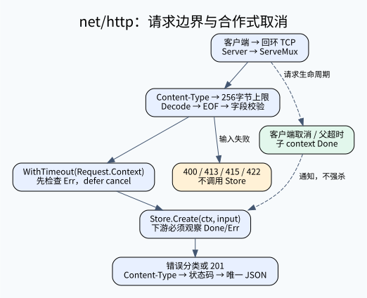

# C13-05 从 net/http 到有边界的订单接口

目标：亲手实现 POST /orders 的输入边界和请求取消链，能解释“服务器还活着”与“业务请求通过测试”为什么是两回事。

前置：Go 函数、结构体、指针、interface、error、defer；基础任务完成后仍不熟悉这些语法，可先读下文“从 Java 迁移”。固定环境与完整启动命令见 [学习路线](../../../materials/go-http/学习路线与边界.md)。



## 1. 先认识完整项目，而不是孤立函数

- cmd/server/main.go：监听 127.0.0.1:0，打印自己拥有的 URL，配置 http.Server，接收中断并关闭
- router.go：NewServeMux 注册 GET /healthz、POST /orders；HandlerFunc 把普通函数适配为 http.Handler
- exercise.go：你补 DecodeInput 和 CreateHandler 中的两个标记区
- model.go：Input/Order、Store 接口、错误分类、加锁的内存演示存储
- contract_test.go：公开业务、取消、真实 TCP 与并发合同；cmd/server 的测试还验证启动/关闭和输出错误
- answers/reference.go.txt：完整标准答案；wrong-solutions/*.go.txt：完整可编译但行为错误的变体

用一次输入说明调用链：客户端 → TCP listener → Server → ServeMux → CreateHandler → DecodeInput → Store.Create(ctx,input) → JSON 响应。Health 成功只证明健康路由可达，不能证明订单路由实现正确。

## 2. 合同先于代码

输入仅支持 application/json（允许 charset 参数），仅接受不超过 256 字节的 body，包括尾部空白。限制器判断溢出时可以读取第257字节作为探测，并非保证底层从不多读一个字节。必须恰好一个 JSON 值，拒绝未知字段、第二个值和尾部垃圾。sku 先 TrimSpace，再要求 1–32 个 Unicode 码点；quantity 是整数且 1–100。该码点限制不等于用户视觉字符数；组合字符仍可占多个码点。

- 201：一次 Store 调用成功，响应包含服务返回的 id、sku、quantity
- 400 invalid_json：语法/类型/未知字段/额外 JSON；不向外暴露原始解码细节
- 413 body_too_large：解码返回的错误是 *http.MaxBytesError，即本次解码实际报告了字节上限错误
- 415 unsupported_media_type：未提供或提供不支持的 Content-Type
- 422 invalid_input：形状可解码但业务字段不符合范围
- 504 deadline_exceeded：合作式业务操作观察到 deadline
- 503 request_canceled：取消时仍可写响应的本课映射；客户端已经断开时不能保证收到它
- 500 internal_error：内部错误固定短句，不泄露数据库地址、凭据或原始异常

本课明确采用“流式解码先遇到的错误”策略：先判媒体类型，失败返回415；再执行有界解码，按解码器返回的错误分类。已经发现语法/未知字段/额外值错误就返回400，不为了把它改成413而继续排空请求体。因此301字节的 `!xxx...`、未知字段后加300空格、第二个JSON后加300空格都为400；错误媒体类型加超量输入仍415。只有解码返回 MaxBytesError 才413。限制仍阻止超量 body 被接受，这不是限制绕过，也不是慢请求的时间上限。

所有输入失败必须在 Store 前结束。Content-Length 不可信，也可能为 -1；不能只靠头部值做 body 限制。默认 ServeMux 的 404/405 是标准库响应，不冒充已经统一成业务 JSON。

## 3. 从可编译红灯开始

Academy starter 会替换两个练习区。离线缓存准备后，在本题 go 目录：

```sh
"$GO_EXECUTABLE" build -buildvcs=false -mod=readonly -tags=nomsgpack -p=1 ./...
"$GO_EXECUTABLE" test -buildvcs=false -mod=readonly -tags=nomsgpack -p=1 -run '^$' ./...
"$GO_EXECUTABLE" test -buildvcs=false -mod=readonly -tags=nomsgpack -p=1 -count=1 -timeout=45s -v ./...
```

前两条只证明编译，starter 应当成功；第三条应报 HTTP_STATUS，不能以“可以启动”算完成。先观察源 task-info.yaml 的 placeholder_text，不要误把仓库作者答案当成学员起点。

### 步骤 A：输入解码

先为 CreateHandler 搭最小调用骨架：DecodeInput → 错误则写响应并 return → store.Create(r.Context(), input) → 错误分类 → 写201。此时先不加子 context/超时。这一整份中间态见 go/stages/01-input-boundary.go.txt，接线后你才能通过请求路径观察 DecodeInput 的变化。不要只补 DecodeInput 却让处理器仍固定返回501。


先用 mime.ParseMediaType 检查媒体类型，再用 http.MaxBytesReader 包住 r.Body。创建 json.Decoder，打开 DisallowUnknownFields，首次 Decode 到 Input。

只解码一次不够：`{"sku":"x","quantity":1} {}` 的第一次 Decode 可以成功。再 Decode 一次到临时值，只有 io.EOF 才算输入完整。该第二次读取也让超量尾部空白触发 body 上限。使用 errors.As 区分 *http.MaxBytesError，其余格式错误按400处理。最后规范化 sku 并检查业务范围。

运行：
```sh
"$GO_EXECUTABLE" test -buildvcs=false -mod=readonly -tags=nomsgpack -p=1 -count=1 -v -run TestRequestContract .
```

重点手算 exact_byte_limit、over_byte_limit、extra_value、null_object、sku_32_runes。JSON null 解码到结构体时保留零值，因此仍需业务校验；未知字段检查并不等于完整 schema 校验。encoding/json 允许重复键且后值覆盖前值，本题不额外拒绝重复键，不要宣称已实现所有企业 JSON 安全规则。

中间态应让整个 TestRequestContract 通过，但 TestContextContract/zero_budget 必须仍失败：它还没有实施业务超时。这个红灯是下一步的工作，不能跳过。私有验收已按独立阶段实际重放时，其结果见对应执行报告；本文自身只声明预期。

### 步骤 B：取消与超时

用 context.WithTimeout(r.Context(), budget) 派生子上下文，立即 defer cancel。先检查 ctx.Err，再同步调用 store.Create(ctx,input)。服务返回后再次检查取消状态，然后只在一处写成功响应。

不能用 context.Background() 替代请求父上下文：会丢失调用方取消、父 deadline 和上下文值。cancel 用来释放资源，不是撤销已提交的副作用；真实数据库事务/幂等性要另设计。此实现不会创建 goroutine 来强行“杀掉”一个不理会 ctx 的 Store。

```sh
"$GO_EXECUTABLE" test -buildvcs=false -mod=readonly -tags=nomsgpack -p=1 -count=1 -v -run TestContextContract .
"$GO_EXECUTABLE" test -buildvcs=false -mod=readonly -tags=nomsgpack -p=1 -count=1 -v -run TestClientCancellation .
```

TestContextContract 用已取消父 context、零预算、服务主动等待 Done 验证语义；不比较“必须在5毫秒内返回”。canceled_after_store_success 让 Store 同步取消父 context、立即检查子 ctx.Err 和非阻塞 Done，再返回成功与 nil error；处理器必须仍返回503。deadline_after_store_success 使用 Go 标准库 testing/synctest 的隔离虚拟时钟：Store 等 Done 后返回成功，必须得到504。取消传播检查在发现无关的 Background 子上下文时立即报 POSTCHECK_PARENT，不会先阻塞等待 Done。deadline 虚拟时钟测试不使用真实 sleep、网络或外部进程，且检查 Store 确实执行一次，避免前置超时误装成后置检查覆盖。TestClientCancellation 在真正 TCP 请求到达 Store 后才 cancel 客户端，等待服务明确报告 context.Canceled。5秒保护只是避免坏实现永远卡死，不是性能断言。

测试不能用同一份可能被篡改的输入自我证明。每个成功行都有独立手写 want Input；先核对传给 Store 的 SKU/数量，再核对完整响应。TestActualHTTP 用“毛笔/7”和“A SKU-9/99”两笔真实请求，独立检查 Store 接收值、响应 ID/SKU/数量及唯一 JSON；TestServiceResultPreserved 另证处理器保留服务返回的字段。

### 步骤 C：全套与完整调用方

运行全套后启动 cmd/server，依次用 curl 观察成功、缺字段、额外 JSON；核对状态码、Content-Type、响应体。调用方测试通过的证据应包括 TestCallerHTTP、TestOutputFailure、TestMainProcess；后者启动并停止自己创建的独立进程，而不是探测某个既有端口。

```sh
"$GO_EXECUTABLE" test -buildvcs=false -mod=readonly -tags=nomsgpack -p=1 -count=1 -timeout=45s -v ./...
"$GO_EXECUTABLE" vet -buildvcs=false -mod=readonly -tags=nomsgpack -p=1 ./...
"$GO_EXECUTABLE" test -buildvcs=false -mod=readonly -tags=nomsgpack -p=1 -race -count=1 -timeout=60s ./...
```

race 需要支持的平台/C工具链，没运行必须记 NOT_RUN。它只检查该次执行出现的数据竞争，不能证明系统没有任何并发错误。

## 4. 四种超时，不要混为一谈

- ReadHeaderTimeout：请求头读取预算；对慢速发头客户端的保护
- ReadTimeout：包括 body 在内的请求读取预算；与 body 字节数上限不是同一问题
- WriteTimeout：写响应的 I/O deadline，不会替你终止业务 goroutine
- 本题 context.WithTimeout：DecodeInput 完成后才开始的业务预算，只有下游合作才有效

完整 server 还设置 IdleTimeout 和 MaxHeaderBytes；HTTP/1 长连接在多个请求间复用连接，每个请求仍有自己的 Request/context。Shutdown 停止接收新连接并等活动请求；本例 BaseContext 连着进程取消上下文，所以 Ctrl+C 同时通知活动业务取消。Shutdown 自己必须用新的、有限时长的 context；不能把已取消的进程 context 直接传进去。它不会自动处理所有 hijacked 长连接，这不在本题范围。

## 5. 从 Java 迁移

- Store 是小接口，StoreFunc 是函数适配器，类似可直接替换的策略；无须容器扫描才能测试
- `input,p := DecodeInput(...)` 同时接收值和错误；`p != nil` 的分支应 return，避免失败后继续产生副作用
- `defer cancel()` 是作用域退出时清理，类似 try/finally；循环内大量 defer 需要留意释放时机
- `*http.Request` 指向请求对象；WithContext 返回浅拷贝请求，不要把长期任务依附于处理器结束即取消的请求上下文
- context.Value 只适合请求范围元数据，不应塞进所有可选业务参数或凭据

## 6. H1–H4 与标准答案

H1：先让 valid、wrong_media 两个子例绿；H2：补第二次 Decode 和边界字节数；H3：读参考答案两个区，给每个 return 标注对应测试；H4：替换完整参考文件后跑全套，再独立重写而不是修改测试。

标准答案的核心顺序是“媒体类型 → 实际 body 上限 → 第一次解码 → EOF 验证 → 业务校验 → 子 context → Store → 错误分类 → 单次响应”。完整 imports、签名、辅助函数均在 [参考答案](go/answers/reference.go.txt)。错误版本位于 wrong-solutions（新增 corrupt-input 和 omit-postcheck 专门保护请求保真与后置取消检查），失败合同在 [变异矩阵](../../../materials/go-http/变异矩阵.json)。

## 7. 面试递进，必须说出理由

1. Handler 和 HandlerFunc 的区别？前者是 ServeHTTP 接口，后者是函数类型并实现接口；注册函数不等于为每个接口创建新 server
2. 为什么只检查 Content-Length 不够？传输可没有确定长度，声明值不是已读取的字节数，限制要发生在 Reader 边界
3. 为什么 MaxBytesReader 不等于 JSON 校验？它限制资源消耗，不理解字段和业务范围；反之校验标签也无法阻止巨大输入读入
4. WithTimeout 能强制停止任意函数吗？不能。它关闭 Done/设置 Err，下游必须观察；不能假装超时响应等于没有写数据库
5. 为什么 ResponseWriter 首次 Write 前设置头？首次 Write 会隐式提交状态；已提交后再写错误 JSON 会形成双响应或坏 JSON
6. 500 为什么不用 err.Error()？内部错误可能含敏感信息；客户端只需要稳定错误码。生产需要请求关联、可控日志/监控，本课只实现公开响应合同
7. 如果把这题升级真实订单服务，还缺什么？数据库约束/事务、幂等键、认证授权、限流、请求追踪、TLS与部署验收；本题测试不能替代它们

## 8. 源码阅读与迁移作业

按 [源码定位](go/docs/源码定位.md) 的固定版本符号读 Request.Context、MaxBytesReader、ServeMux.ServeHTTP、Server.Shutdown。画出父 context → 子 context → Store 的取消方向。

迁移作业：为订单增加一个客户端请求 ID，但不要把它当幂等键。先写测试规定接受哪些字符、长度、错误码以及是否传播；说明为什么扩展输入字段需要同步改变严格解码合同。这是待实现扩展，未纳入当前自动通过数。

## 统一课程入口

从课程根运行 `bash scripts/gradle.sh :go-course-http-request-lifecycle:test -PgoExecutable="$GO_EXECUTABLE" -PgoModuleCache="$GO_MODULE_CACHE"`。模块缓存必须预先准备；检查只读依赖清单、离线执行。此入口的通过仅覆盖本题公开合同，不代表整课或 Academy 原生验收。

## 官方参考核对

[Go net/http 包文档](https://pkg.go.dev/net/http)。重点阅读 Request.Context、MaxBytesReader 和 Handler，映射本课的输入边界与请求取消链。

链接用于核对概念和 API；本文的固定依赖版本、公开测试及答案共同定义练习，不把官网最新示例自动升级为课程版本。
