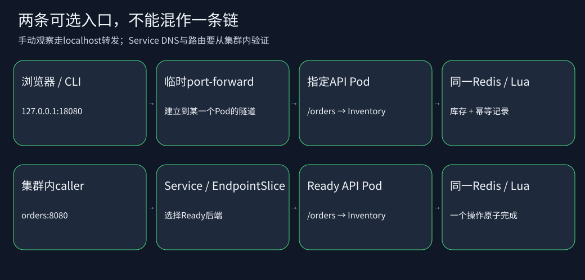

# 从Compose订单服务到Kubernetes

你已在C11-01..03见过镜像、进程、Redis和容器DNS。本项目保留`Inventory`/`RedisClient`的库存与幂等契约，增加明确的启动状态、版本、配置重载和Pod故障观察。不要求先会Spring、Helm或前端框架。

## 第一次读代码的顺序

```text
kubernetes/
  src/labs/KubernetesApp.java  启动HTTP服务、路由、SIGTERM排空
  src/labs/ProbePolicy.java    C11-04需要补的三种健康策略
  src/labs/AppConfig.java      C11-05需要补的配置加载与校验
  src/labs/Inventory.java      已提供：Lua原子库存和请求重放
  src/labs/RedisClient.java    已提供：有界RESP连接、分层错误
  src/labs/HttpCaller.java     集群内完整调用方，共用应用镜像
  src/labs/FixtureCtl.java     只有受保护exec路径能触发的合成故障
  web/index.html              已提供：浏览器下单页
  manifests/                  完整参考YAML，不是需要全部从零写
  bin/lab.py                  环境检查、独立集群创建/访问/停止
  bin/scenarios.py            公开真实Kind测试，查看每条断言
  bin/verify_java.py          明确调用才执行Java编译/公开合同
  tests/                      离线合同/安全回归，不是E2E
  test-java/                  Java真值表/配置合同
```

练习从每课目录开始改；共享项目是标准参考。`lab.py up --task-dir ...`先复制完整共享工程到私有工作树，再覆盖声明的题目文件，绝不改共享参考。没有`--task-dir`时运行标准答案，用来建立基线。

## 请求真正经过哪里



浏览器或`bin/call.py` → 127.0.0.1:18080的临时port-forward → 选中的Pod。注意port-forward连Service时通常选一个Pod建立隧道，不能用它证明Service负载均衡。真实Service路由/DNS实验由集群内caller → orders:8080 → Ready EndpointSlice → API Pod → redis:6379 → 库存Lua完成。

`/startup`：本进程8秒初始化是否完成；`/live`：初始化后本进程是否陷入需要重启的局部故障；`/ready`：初始化、依赖可达、已seed、没有排空/合成未就绪条件是否同时满足。下游不可达不会让`/live`失败。

`POST /seed`幂等初始化库存10。`POST /orders?request_id=demo-001&quantity=2`第一次201并扣减，再次同请求200/REPLAY且不重复扣减；相同id不同数量409。`GET /stock`返回剩余库存；`GET /info`只返回公开版本、环境公告和文件公告，不返回密码。`GET /slow`模拟已接受的1.5秒请求，TERM最多等待3秒再关闭，容器总终止预算10秒。

## 运行前的资源与版本

- JDK21只用于可选宿主Java合同；真正容器构建复用台账的JAVA_BUILD_IMAGE
- Python3.12与PyYAML6.0.3；kubectl、kind、Docker必须已按官方方式安装，driver不自动安装
- kind v0.33.0 + Kubernetes/kubectl v1.36.4的固定组合，kind node必须digest固定。值由唯一总课程台账读取，新增项提案在integration目录
- Docker Linux容器、cgroup v2、Docker VM至少配置2CPU/3GiB是保守入门门槛；这是总配置而非实时空闲容量，不是容量承诺。单节点控制面本身也占内存
- 稳态两API共请求200m/256Mi，Redis请求50m/64Mi，caller请求25m/32Mi；滚动峰值最多3个API。控制面额外占用不在上述requests总数中
- 不开metrics-server、Ingress、mesh、数据库复制；不连接云账号，不创建付费资源

## 命令走一遍

先在仓库唯一台账整合并审计`integration/versions.env.additions`，不要把它单独作为完整env文件。下面`$LEDGER`是现有总课程版本台账的绝对路径；`$PROJECT`是本共享项目绝对路径。

在当前源码候选根目录可这样定位第一课；最后一行要换成实际唯一台账，不能照抄占位路径。集成到总课程后，PROJECT/TASK_DIR改为该总课程中的对应路径。

```sh
PROJECT="$PWD/course/materials/kubernetes"
TASK_DIR="$PWD/course/c11-cloud-native/04-kubernetes-basics/01-probes-and-replicas"
LEDGER="/绝对路径/总课程唯一版本台账"
python "$PROJECT/bin/lab.py" preflight --versions "$LEDGER"
python "$PROJECT/bin/lab.py" up --versions "$LEDGER" --task C11-04 --task-dir "$TASK_DIR"
python "$PROJECT/bin/lab.py" observe
python "$PROJECT/bin/lab.py" call
python "$PROJECT/bin/lab.py" verify --scenario probes
python "$PROJECT/bin/lab.py" open
# 新终端运行；open保持前台，在浏览器打开http://127.0.0.1:18080
python "$PROJECT/bin/call.py" stock
python "$PROJECT/bin/call.py" order --request-id demo-001
# 关闭前台转发后，按需删除本次独立集群。镜像缓存保留。
python "$PROJECT/bin/lab.py" down
```

`up`会随机生成c11-kind-加12位run标识，仅创建独立集群与同名namespace。已有同名集群直接拒绝；从不使用默认context。kubeconfig只落入权限0700的.runtime目录，文件0600，不输出、不打包、不上传。所有真实测试先验证namespace UID、节点容器ID和课程标签；修改前再验证目标UID。只使用新合成密码，严禁替换成真实业务Secret。

## 怎么看测试结果

- YAML_CONTRACT_PASS：只说明练习YAML满足公开静态合同
- Java合同PASS：只说明策略/配置的Java实际运行通过；不是集群结果
- Kind场景PASS：必须得到HTTP响应、Pod UID/重启次数、EndpointSlice或控制器状态等实际证据
- FAIL：明确观测到业务/教学合同失败
- INVALID_ENV：缺Docker、工具版本/身份不符、没有受控集群、调用失败而无法建立负例证据；不能转成预期失败或绿灯
- NOT_RUN：没有执行，不能当作跳过后成功

当前测试状态只看本候选`qa/VERIFICATION.json`。本地生成的.runtime不可进入任何发布manifest。

## 数据寿命与安全边界

本批Redis用emptyDir，目的是只学习工作负载与发布，Redis Pod删除后数据会丢失，集群删除必然丢数据。API滚动更新不会删除Redis Pod。实验中的下游故障只改Redis Service的selector，不通过杀Redis伪装持久性。持久化、备份恢复在C11-07完成；本批不作高可用/灾备承诺。

Namespace和Pod Security是有用边界，不能等同于完备租户隔离。本地kind控制节点本身需要Docker权限，driver不会修改宿主安全设置。只在专门学习机器上运行；不要把任何生产kubeconfig或真实密码复制进项目。
