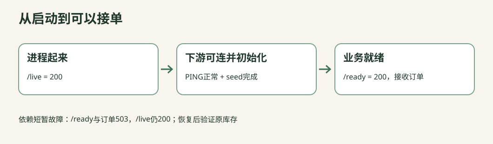

# C11-02 Compose生命周期：亮着灯不等于能接单

> 源码草稿：请先阅读共享项目的验证说明。Java、真实Docker/Redis和Academy原生Check尚未执行；preflight/up等词表示待集成的环境动作，不能当成已经可用的命令。HTTP示例要求你已启动对应的本机实验环境。



你已能运行一个镜像。这次要让API和Redis一起正确启动，并且停过、重启过、重复初始化后仍保留正确库存。新概念只有“就绪”和“幂等初始化”；Compose语法围绕这两件事展开。

## 检查点1：先认清资源属于谁

读 `infra/cloudnative.compose.yaml`，把下面五项写进观察记录：

- 两个service名字：cloudnative-api和redis
- 宿主唯一发布端口：127.0.0.1:18085，进入API容器8080
- Redis没有宿主发布端口，容器间使用redis:6379
- volume是Compose project下的cloudnative-redis-data，没有写死全局name
- 每个服务都有内存、CPU、进程数和日志上限；本课不是无成本的“后台随便多开几份”

```
project：totalacademy-<课程目录标识>-c11-02
  ├─ cloudnative-api      384 MiB / 0.75 CPU / 96 pids
  ├─ redis               192 MiB / 0.5 CPU / 64 pids
  ├─ network：cloudnative
  └─ volume：cloudnative-redis-data（stop后仍保留）
```

这只是容器限制，不是整台机器所需内存。Docker桌面、镜像构建和操作系统还要资源；端口和可用资源预检失败应停下说明，不自动开启另一整套中间件。

## 检查点2：第一次启动，故意不要先seed

用统一入口的up启动本课；它先等待Redis健康与API下游检查，不应宣称业务已完成。

```sh
python materials/cloud-native/bin/call.py /live
python materials/cloud-native/bin/call.py /downstream-check
python materials/cloud-native/bin/call.py /ready
python materials/cloud-native/bin/call.py '/orders?request_id=before-seed&quantity=2' --method POST
```

新namespace的预期：前两条200；/ready为503且seeded=false；订单为503 NOT_SEEDED。这里“200、200、503、503”才是正确结果。

如果你上次实验留下了数据，这个namespace可能已经seed。不要为了重现截图清空卷；用统一验证器分配的新namespace做fresh验证，并在观察记录写清“旧数据仍存在”。

为什么仅写`depends_on: redis`不够？容器running只说明进程起来了。Redis的PING健康检查再说明它能响应命令，但还不能证明应用自己的库存schema已初始化。应用ready要核对业务所需条件。

## 检查点3：实现ready判断，别改成“永远绿”

本任务 `CloudPolicy.java` 能编译，但starter直接返回true。输入是三个布尔值：dependencyHealthy、seeded、draining；输出是“现在是否允许接业务流量”。

先手写真值表里四行：

| 下游健康 | 已初始化 | 正在排空 | 预期ready |
|---|---|---|---|
| true | true | false | true |
| false | true | false | false |
| true | false | false | false |
| true | true | true | false |

然后补另外四行。正确逻辑可以写成短逻辑式，也可以用分支逐个拒绝；两者都必须通过同一份测试。不要让测试也调用你的ready函数来计算“预期值”，否则错误实现会自己证明自己正确。

注意 `/live` 不调用这个判断。Redis短暂断开时，应用仍能响应请求并返回明确503，它不一定需要被重启。这个区别是后续Kubernetes三种探针的先修。

## 检查点4：先观察幂等，再读Lua

```sh
python materials/cloud-native/bin/call.py /seed --method POST
python materials/cloud-native/bin/call.py /seed --method POST
python materials/cloud-native/bin/call.py '/orders?request_id=one&quantity=2' --method POST
python materials/cloud-native/bin/call.py /seed --method POST
python materials/cloud-native/bin/call.py /stock
```

fresh数据的预期顺序：

1. created=true、stock=10
2. created=false、stock=10
3. CREATED、remaining=8
4. created=false、stock=8
5. stock=8

错误seed最容易在第4步露馅：每次启动都写10，会把已经卖出去的库存“补回来”。因此“连执行两次得到10”只是弱测试；必须先有业务变更，再seed一次证明不覆盖。

读 `Inventory.SEED`：在一个Lua脚本里检查整个hash是否存在，再写schema和stock。不要拆成“先EXISTS再HSET”两个应用请求，否则两个初始化者可能交错。不要把本课简化schema检查误当正式数据库迁移；升级schema要单独设计迁移版本与回滚。

## 检查点5：订单重试也要幂等

对同一个request_id再次买2份，预期200 REPLAY、remaining仍8；换成3份，预期409 CONFLICT。然后读库存，仍应8。

```
第一次：无记录 -> 查库存足够 -> 扣2 -> 记录(id,数量,结果) -> CREATED
重放：  已记录且数量相同 -------------------------------> REPLAY
冲突：  已记录但数量不同 -------------------------------> CONFLICT
```

这些动作在同一个Redis Lua脚本中执行。可见真实Docker测试会并发发送12个1份请求，剩8份时应正好8个成功、4个SOLD_OUT，最后库存0。Python假服务的并发测试只能证明测试器模型，不算Redis Lua原子性证据。

## 检查点6：停Redis，再恢复

通过本课统一入口限定的服务停止动作（或真实验收器）暂停本项目Redis。不要stop其他课程的共享项目，不要使用全局prune。

观察三件事：

- /live仍200，说明Java还活着
- /ready与订单503，不应假造“下单成功”
- 错误包含具体层，例如CONNECT，而不是无限等待

恢复同一个Redis服务，再检查/ready恢复200，之前库存仍存在，重复seed不能回填。只验证端口重新打开不够，还要验证具体库存值。

这里验证“正常停止重启后保留”。它不能证明断电绝不丢数据，也不能替代真实备份恢复；本课AOF、volume与业务幂等分别解决不同问题。

## 检查点7：结束时留得住，下一次找得到

使用本课stop，记录项目名、volume名、最后stock与证据目录。停止不删除volume。下一次up应找回数据，而不是默默创建一份看似正确的新库存。

如果你要真正删除数据，先明确哪一个volume、里面是什么以及如何备份；本课脚本不提供“为了通过测试清空所有”的快捷方式。

## H1–H4 提示

- H1：ready只有一个组合为true，把另外七个组合先写出来
- H2：开始排空必须比其他成功条件优先拒绝
- H3：幂等初始化的关键断言是“发生交易后再seed不回填”，不是只比两次初始输出
- H4：比较共享正确CloudPolicy和answers显式分支版本；再对照Inventory.SEED的单脚本判断

## 常见误区

- up退出0：只说明编排命令成功，不能代替业务就绪
- 把healthcheck当“自动修复器”：健康状态和是否重启取决于运行平台与策略，不能看到unhealthy就假设会自愈
- 给所有服务同一个全局volume名字：不同课程可能读写彼此数据；使用project范围和明确namespace
- 失败后立即删卷重跑：会抹去最重要的恢复证据，也可能丢用户数据

## 面试与企业迁移

“启动顺序、readiness和重试是什么关系？”先后顺序减少启动竞争；readiness回答现在能否服务；有界重试/超时处理运行中故障。三者不能互相替代。

“SET NX不就够了吗？”单个键只设置一次可用NX，但本课需要schema和stock一致初始化，以及交易后保持库存；应围绕原子业务边界选择操作，不为炫技无条件加Lua。

“重启后有数据就算可靠？”只覆盖正常重启路径；还要定义故障模型、写入确认语义、持久化窗口、恢复点和恢复时间目标。
