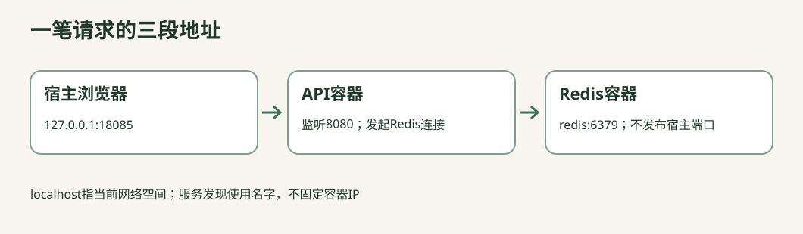

# C11-03 从端口到DNS：为什么容器里的localhost连不上Redis

> 源码草稿：请先阅读共享项目的验证说明。Java、真实Docker/Redis和Academy原生Check尚未执行；preflight/up等词表示待集成的环境动作，不能当成已经可用的命令。HTTP示例要求你已启动对应的本机实验环境。



目标：根据请求经过的层定位问题，而不是反复改IP、扩大超时或重启。你将修正一个“本机能用、放进容器就失败”的地址策略。

## 检查点1：在图上写出三段地址

先不要执行命令。给图中三个问号写答案：

```
你的浏览器（宿主网络）
   |
   | A = ?                 A：127.0.0.1:18085
   v
Docker发布端口
   |
   | B = ?                 B：cloudnative-api容器中的8080
   v
Java API容器
   |
   | C = ?                 C：redis:6379
   v
Redis容器（内部服务，不发布宿主管理端口）
```

宿主端口18085和容器端口8080不需要相同；Redis内部端口6379与总课程其他演示可能使用的宿主映射端口也不是同一概念。当前C11根本没有发布Redis宿主端口，因此容器不能靠宿主映射“绕过去”。

## 检查点2：读并运行starter

本任务AddressPolicy忽略配置，直接返回localhost:6379。它可以编译，但当Redis在另一个容器时会失败。

先作预测：localhost此时指向谁？是在宿主执行调用方，还是在API容器内执行Redis连接？你要追踪的是**发起连接的那个进程**。

运行可见策略测试会首先指出未使用注入的service DNS。真实Docker错误对照会在一次性容器内请求localhost:6379，预期CONNECT失败；这是可重现的错误解，不需要你改宿主网络设置。

## 检查点3：修正地址策略

在AddressPolicy中读取REDIS_HOST、REDIS_PORT：

- 默认服务发现版本：未配置时用redis:6379，配置了则尊重显式值
- 显式地址版本：必须提供这两个配置，缺少时启动明确报错。它适用于把配置错误尽早暴露的团队
- 端口必须是1..65535范围的整数。`http://redis`不是host；URL、host和port不要混为一个字段

两个正确版本都接受`REDIS_HOST=inventory-blue,REDIS_PORT=16379`，不能为了当前测试写死redis。不要把固定容器IP塞进源码，容器更新后IP可以变化；用服务名表达“我要找谁”。

## 检查点4：把错误分到正确层

```text
名字 --DNS--> IP --TCP连接--> 对端端口 --AUTH/RESP--> Redis命令 --业务schema--> 可接单
       |            |                     |                         |
      DNS         CONNECT            AUTH / PROTOCOL             NOT_READY
                    \--------- 等待超时：TIMEOUT ----------------/
```

执行已提供调用方：

```sh
python materials/cloud-native/bin/call.py /downstream-check
```

正常预期为200、PONG、layer=APPLICATION。按真实Docker验收器依次运行以下合成错误配置，它只作用于本课专用verify项目：

| 错误 | 你应预测的层 | 修复方向 |
|---|---|---|
| host=academy-c11-missing.invalid | DNS | 检查名字拼写与所属网络，不先改Redis密码 |
| host=localhost,port=6379 | CONNECT | 当前容器没有Redis；改service DNS |
| host=redis,port=1 | CONNECT | 容器目的端口不对；不要写宿主端口 |
| 正确地址、合成错误密码 | AUTH | 网络已到达Redis，再核查认证配置 |
| 对端已连接但迟迟不答 | TIMEOUT | 看等待阶段与预算，不能无限重试 |
| 对端返回不符合RESP的内容 | PROTOCOL | 可能打到错误服务或协议，不归为DNS |

本地native测试通过真实TCP假服务制造AUTH/TIMEOUT/PROTOCOL；Docker测试对DNS和容器localhost进行真实验证。报告必须保留这层边界，不能把两者混为“所有容器故障已验证”。

## 检查点5：恢复后再跑业务，不以“能连上”结束

把配置恢复为redis:6379后，先/downstream-check，再/ready，再/stock，最后以新request_id做一笔有余量的订单。如果库存已经耗尽，应得到409 SOLD_OUT，这也是正确业务结果；不要把SOLD_OUT当网络失败。

为什么先后验证？PING只证明某个Redis会说PONG，不证明连的是正确namespace、有正确schema，也不证明库存没有被错误初始化覆盖。

为了真实测试的可重复性，统一verify使用专属项目与新namespace，并在报告里保存它们。它不会清空你浏览器实验中留下的订单。

## 检查点6：不要为调试随便开管理口

查看Compose的ports：只允许127.0.0.1:18085:8080。Redis没有ports；需要内部诊断时用本项目一次性诊断进程，不改成0.0.0.0:6379:6379。

绑定到所有网卡可能把无生产认证设计的教学API暴露出去。绑定回环能降低误暴露，但同机其他进程仍可能访问，不应当作真正的用户授权。后续网络策略与mTLS也各有边界，不能互相替代。

## 检查点7：写一份能交给同事的故障记录

按这六句话完成观察：

1. 症状：哪个请求、HTTP多少、layer是什么
2. 范围：project、service、namespace和镜像ID
3. 证据：配置与实际调用结果，秘密不进日志
4. 假设：错误发生在哪一层，为什么不是上一层/下一层
5. 修复：只改最小配置，不扩大所有超时、不开放所有端口
6. 恢复：/ready与具体库存/订单契约重新通过

自动检查只能判断必要证据是否齐全，不能替你证明因果解释正确。观察题不应被伪装成自动绿灯。

## H1–H4 提示

- H1：每看到localhost，就补一句“从哪个进程看出去”
- H2：Compose service名字用于内部发现；HTTP宿主端口只给宿主调用方使用
- H3：先判断DNS、TCP还是AUTH失败，修复方向通常完全不同
- H4：比较共享AddressPolicy与answers显式配置版本；两者都保留调用方输入验证

## 面试题与迁移

- 容器重建后IP变化，客户端该怎么办？使用稳定服务名，重新解析/重建失败连接；不要缓存一个永远不变的容器IP
- 网络超时是否一定是DNS？不一定，需区分解析、连接与读取阶段。本课把Socket读取和连接超时统一归TIMEOUT，并在文档承认其诊断粒度，不伪造更细证据
- 为什么管理端口不发布？减少非必要访问面；调试应选最窄范围，不是把所有端口映射出去
- 换成Kubernetes，哪些概念会继续有用？进程、容器端口、服务名、就绪、持久化与请求排空继续存在；Pod/Service将增加新的编排层，而不是推翻前面全部知识
