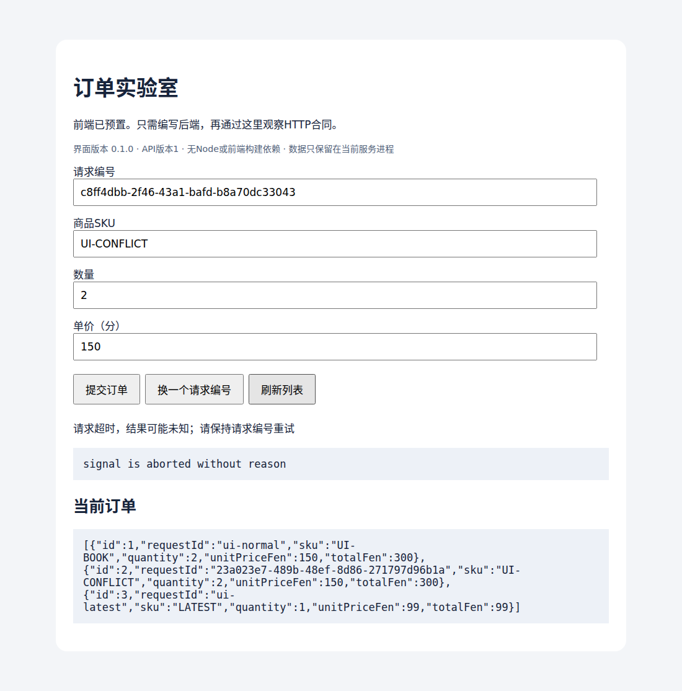
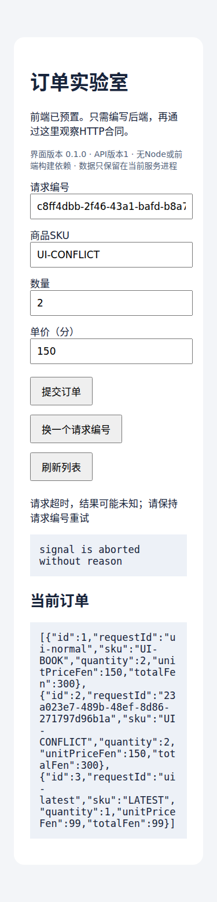

# Java框架课程阶段报告

更新时间：2026-09-30。范围仅为C04/C05框架课程，不代表整个V1完成。

## 当前验收总览

- 14个渐进阶段、20个可编码占位；63项参考实现测试在真实CI通过，0失败、0跳过
- 14个学生起点与18个错误实现均编译成功后被公开测试拒绝，共32个负例；14个完整调用方通过
- 真实MySQL事务集成通过，Testcontainers1.20.6与共享镜像台账统一；独立课程快照及SHA已配置
- Linux云端启动、健康检查、真实HTTP创建与停止脚本通过；macOS未实测
- 22个官方源码路径与固定提交已核验；逐节IDE断点与口述仍需独立学习
- 真实Chrome全部11项UI检查通过，桌面/375px中文截图已检查；对应[CI36735424856](https://github.com/weilhuang/backend-interview-labs/actions/runs/36735424856)，完整范围及截图见本报告后文
- Academy原生导入/Check/Reset与正式课程包尚待验收；Boot4运行对照未执行

以下阶段一至阶段四保留当时的发现和验证边界，不能将历史“未运行”替代本节当前结果。

已增加profile/命令行优先级、CORS、安全口令过滤器、有界队列饱和与多候选DI用例。全部Java按统一格式排版，题目用具体ASCII机制图，每节标准解与解释直接可读。公共机器可读摘要见docs/验收摘要.json，详细边界见docs/课程覆盖与验收边界.md。

## 阶段一 已编写的实质内容

- 已编写14个渐进任务的真实Spring/Boot源码、完整调用方和可见测试
- 已提供02/07阶段预置中文订单页，无Node或前端开发负担
- 已写每节公开标准解、机制解释、ASCII图解、源码入口和面试追问
- 基线固定JDK21、Boot3.5.16、Framework6.2.19；Testcontainers统一1.20.6
- MySQL集成通过共享镜像台账读取，不在课程硬编码额外镜像版本

## 阶段一当时的验证状态（历史）

| 项目 | 状态 |
|---|---|
| 源码与元数据编写 | 已生成，仍在实际编译/修订 |
| Maven官方BOM版本核对 | 已下载并核对 |
| 完整JDK21与Gradle启动 | 已启动；使用课程build目录内的Gradle用户缓存 |
| 全部构建/单元/真实HTTP/H2测试 | 正在解析依赖并执行，尚未宣布通过 |
| 错误解与学生起点回归 | 待基础构建通过后执行 |
| 真实MySQL/Testcontainers | 尚未运行；需要Docker |
| 浏览器交互与布局 | 尚未运行；HTTP页面测试不代替UI验收 |
| IDEA/Academy预览/导出/干净导入 | 尚未运行 |
| Boot4迁移执行 | 未运行，本课基线为Boot3 |

## 环境记录与局限

云端Maven直接请求较慢，使用已有允许代理路径与仅本机只读桥加速Gradle解析。桥只访问官方Maven Central，不改写依赖元数据；普通学习不需要该桥。Java目标和实际完整JDK都是21，不沿用旧source17验证结论。

后续每次实质验证通过或暴露问题都更新本报告，保留准确的执行范围。不用静态配置存在、未完成测试或未运行界面冒充课程已完整就绪。

## 阶段二 首个可验证子模块

01配置绑定模块已在完整JDK21、Gradle8.10.2、真实Boot3.5.16下运行4项JUnit测试，全部通过：默认绑定、外部配置覆盖/业务边界、错误配置启动失败、默认上限。

02首次HTTP测试遇到Mockito默认内联MockMaker试图自行附加Java Agent，被当前云环境拒绝，5项测试因此在测试生命周期初始化阶段失败，不能算业务错误。采用Mockito官方支持的子类MockMaker（本课不mock final类）避免代理附加；这不改变网络或系统安全设置。配置文件对学习者可见，随后重跑全课。HTTP、H2及其他模块尚未据此宣布通过。

## 阶段三 框架基础运行与真实集成通过

在完整Temurin JDK21.0.12.1+1上，Gradle8.10.2实际执行14阶段的基础测试，共57项，全部通过。覆盖配置校验、真实随机端口HTTP、MVC切片、认证/授权/CSRF、H2真实JDBC事务、Bean生命周期、循环依赖、JDK/类代理、自调用、REQUIRED/REQUIRES_NEW/受检异常规则、线程事务边界、自定义参数解析和自动配置条件。

修复了生命周期测试中重载stop方法引用的编译歧义；重新跑完整测试后记录57/57。每阶段依赖锁已生成。原始结构化记录为authoring/gradle-verification.json；公开测试完整可见。

真实MySQL单独放在integration-test源集，用integrationTest显式执行，继续读取共享MYSQL_IMAGE、统一Testcontainers1.20.6。基础test不编译或运行该源集，因此57项通过不包括Docker/MySQL。浏览器、Academy和Boot4验证仍未执行；学生起点/错误变体回归正在执行。

## 阶段四 最终代码检查与交付边界（历史）

完成Java格式化后，重新以--release21编译并运行全课61项基础测试与31个负例；全部符合预期。14个调用方、独立MySQL集成编译、共享镜像读取、启动/检查/停止脚本均有记录。没有推送或修改其他课程目录。

仍需在支持相应能力的已授权云端关闭浏览器、真实MySQL与Academy原生验收。浏览器失败属于执行环境拒绝socket创建，未尝试关闭系统安全控制；未把它转移到用户Mac。课程目前可供源码与自动测试审阅，不能标记全部外部/人工验收完成。

## 独立审查修复：关闭任务与跨平台停止脚本

发现并复现C04-06的真实缺陷：shutdownNow会从队列移出FutureTask，但不会自动取消它。旧代码关闭返回后，排队Future仍isDone=false/isCancelled=false，后续get永远没有执行者完成。已显式取消返回的排队Future，统一两秒关闭预算（1.5秒正常完成，其余用于请求中断后清理），并在退出时恢复调用线程中断标记。未响应中断时明确报告关闭失败，不伪装强杀成功。

本轮完整JDK21严格编译与真正JUnit执行：受影响6项全部通过；“移出队列却不取消Future”变体被新增2项拒绝；学员空实现6项均拒绝；完整Usage输出42并正常退出。超时和调用线程被中断两条确定路径都断言executor已终止、排队Future已取消，没有只靠sleep猜测。公开答案、占位偏移、清单和生成器同步。全课当前63项，未把本次6项重跑冒充63项同轮通过。机器记录：authoring/lifecycle-regression.json。

同时修复course.sh依赖/proc导致Mac不能正常stop的问题。现使用ps状态与完整命令行，结合每次启动的随机128bit实例token和精确主类标记，只向确认归属的单个PID发TERM。无PID、非法PID、已退出、token不符、主类不符、正确停止和重复停止等9项Linux隔离回归已通过；不会使用广泛pkill或强杀。check也先确认本实例身份，不把任意同端口服务直接当成本课就绪。macOS尚未实测，保留明确验收门槛。

本地再次尝试Gradle受离线文件仓库未解析锁定jackson-bom2.21.4影响，未修改依赖锁掩盖问题；上述修复使用既有真实依赖classpath进行严格javac/JUnit验证，新提交完整Gradle以CI复测为准。

## 云端浏览器验收进度

真实GitHub构建已通过作者测试、MySQL事务集成、全部调用方和32项负例。首次浏览器脚本有未设置上限的等待，运行未返回，因此没有界面成功证据。已为页面动作、路由屏障和总任务增加有界超时、逐阶段日志与失败截图，保留全部原业务断言，等待新CI定位与验证；不会通过跳过恢复/乱序用例把UI变绿。

### 最新实际 CI 证据：后端完成，界面部分通过

[运行36731387049](https://github.com/weilhuang/backend-interview-labs/actions/runs/36731387049)的原始JUnit XML核对为63项基础测试、1项真实MySQL集成，失败/错误/跳过均为0；14个调用端和32项负例也通过。

真实Chrome已完成首页/空态、创建、同键重试、冲突、输入边界、在途禁用、网络失败恢复和五秒超时。脚本在“旧刷新响应不能覆盖新结果”场景未捕获到预期响应而有界失败，因此界面整体验收仍未通过。新增路由与页面异常诊断，不跳过此用例。

实际查看失败截图发现runner缺少中文字体，中文呈方框；已在独立UI作业加入Ubuntu官方fonts-noto-cjk，并输出字体匹配及浏览器版本，等待重跑后检查截图。DOM含中文不等于中文排版已正确渲染。UI与后端作业分开并行，均保留验收，避免诊断界面问题必须先等待全部负例。

## 2026-09-30 独立课程镜像台账补齐

镜像值由仓库 `infra/versions.env` 唯一真源自动生成到 `shared/versions.env`；SHA256、来源清单、Gradle配置与Java读取器全部登记在 `additional_files`。完整仓库拒绝快照漂移，独立目录无需父仓库。`LAB_SHARED_VERSIONS` / `LAB_REPO_ROOT` 可显式覆盖，错误路径不静默回退。全部Gradle Test与JavaExec统一读取Ryuk/tiny辅助镜像。

本次云端验证：13项读取/拒绝边界测试通过；三门课程在 `/tmp` 无父仓库副本的 Gradle `verifyCourseVersions --offline` 全通过；7个MySQL、7个Redis及14个框架模块的完整生产与测试源码离线编译全通过，包含框架真实MySQL测试源码；三门普通学员副本完整保留快照与读取器。本次没有Docker，不能把编译与配置验证当真实服务回归；原有业务实现和fixture不变，真实CI仍由仓库工作流复核。

源码仓库保留Wrapper时可用CLI；Academy官方ZIP可能移除Wrapper入口，应使用Check/Run或Gradle工具窗口。详情见 `shared/README.md`。本次未执行原生插件导出与干净导入。

后续独立UI运行36733937632确认：刷新按钮的真实点击确实执行load（序号5→6），但测试反复unrouteAll/route切换后未捕获预期GET；尚无证据将此归为后端业务错误。已把故障注入重构为一次注册、显式normal/offline/timeout/stale-get模式的单一路由，保留真实后端旧快照、真实后端新订单和乱序响应不覆盖断言，不用虚构订单响应代替。该调整仍需下一次CI验证。

### 真实界面验收通过（2026-09-30 15:17 UTC）

提交`5d091ef0c906c0d14d4c8e5b2d307e8ec13d13b9`的[独立UI作业](https://github.com/weilhuang/backend-interview-labs/actions/runs/36735424856/job/109955726288)通过全部11项断言：中文空态、真实创建、幂等、冲突、表单边界、在途禁用、网络失败恢复、5秒超时、真实旧响应不覆盖新结果、窄屏无溢出、无页面脚本异常。保留Chrome沙箱；故障注入只延迟/中止测试请求，订单和旧响应快照都来自真实Spring Boot接口。

已实际查看两张截图：中文正常、字段和按钮可见、JSON换行、375px窄屏无横向溢出。截图是模拟超时和乱序后的状态，保留“结果可能未知”提示，同时列表已显示后来创建的订单；不是接口失败截图冒充正常创建。

375px窄屏完整截图

结构化证据在`authoring/ui-verification.json`，原CI artifact 11107116615。此UI验证连接02的真实内存订单后端；07复用同一页面资源，其JDBC业务另由公开测试验证，不能外推为07数据库部署端到端已验。Academy官方导入/Check仍是单独门禁。

## 原生Academy代表性验收通过（2026-09-30）

已在云端Linux的IDEA2026.1.5（261.27258.48）、Academy2026.9-2026.1-1070、完整Temurin21与本地Gradle8.10.2中完成官方归档导出及干净导入，识别14题、20个作答区。没有使用个人Mac。默认在线下载受本云端Connection refused限制，实际使用已校验的官方本地分发、独立缓存和精确版本离线Maven仓，未改依赖锁、未关闭TLS。

实际Check与Reset：

- 01配置绑定：TODO显示Incorrect，5项测试中2失败、3通过；公开参考解Correct，5项全部通过；Reset确认后Content is reset，TODO与初始文件逐字节一致
- 08最小容器：TODO显示Incorrect，5项中3失败、2通过；公开参考解Correct，5项全部通过；Reset确认后Content is reset，TODO恢复且字节一致
- 08的Usage通过IDE main运行按钮输出“订单创建于示例时刻”，退出码0

结果有新JUnit XML支持，正确解均为失败/错误/跳过0；两份正确解XML时间分别为18:09:46、18:19:34 UTC。较早一次配置Check因云端IDE中断没有确认结果，未计入通过；恢复后从同一官方包再次Create New导入并重新验证。参考解仅填入独立学员目录，源码仓库的实现、测试、占位与锁未改。

导入保留14题完整公开答案、14个Usage、16份默认测试源码、另1份MySQL集成测试源码、shared台账/校验/读取器和两张PNG。两题中文正文、运行模式、ASCII图、提示、完整标准答案与解释、公开测试均在原生界面查看。两张随课PNG也在IDE实际打开，尺寸1100×1114与375×1551；它们是前述独立浏览器CI的场景证据，不是本次Academy操作截图。Task栏建议拉宽到约600像素，窄栏会折行或产生横向滚动。

官方ZIP仍剔除gradlew、gradlew.bat、gradle-wrapper.jar，仅留Wrapper配置；已保留Academy Check/IDE Run/Gradle工具窗口与源码CLI两种运行说明。没有手工向官方包注入Wrapper。

本次是两类代表题验收，不是14题全部逐题GUI通过。未执行其余12题完整GUI循环、Preview Course、导出器Check all tasks、动态断点、非Linux兼容性或用户独立迁移；云端无Docker，没有GUI真实MySQL集成结果，原有MySQL/浏览器CI单独记录。本段记录已经完成的首包代码验证；最终官方修订归档的哈希、文档差异与干净重导入核对以仓库根目录的界面验收报告为准。可选AI/训练与解答分享未选，未登录JetBrains账号。
